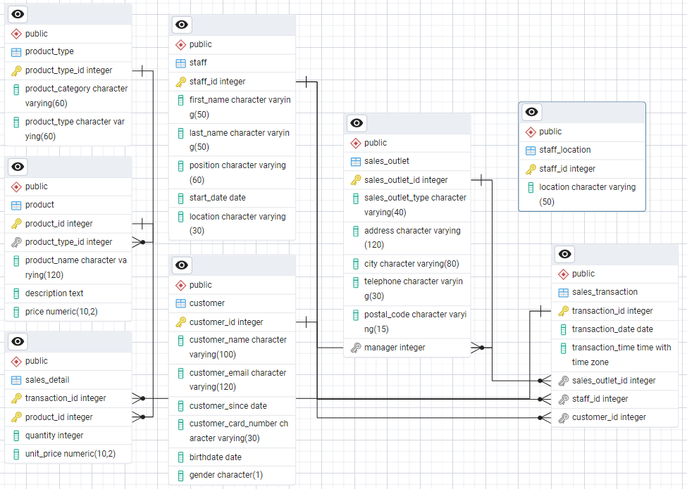

# Coffee Shop RDBMS (PostgreSQL + pgAdmin)

Relational database project using **PostgreSQL** and **pgAdmin**.
Includes: schema (DDL), seed data (DML)/CSV, ERD, and optional full backup.

## Structure
- `sql/schema.sql` – database schema
- `sql/seed.sql` – sample data (or CSVs in `data/`)
- `docs/ERD.png` – ERD diagram
- `backup/coffee_shop.full.backup` – full dump (optional)
  
  
  
> **Highlights**
> - Normalized schema + FKs
> - Reproducible seeding (SQL/CSV)
> - Views + 1 materialized view
> - ERD included • Run in < 60s

## Quick Start
### Option A — SQL files
Run in pgAdmin (Query Tool) in order:
1) sql/schema.sql
2) sql/seed.sql   (or import CSVs from data/)
3) sql/views.sql
   
### Option B — Full backup
pg_restore -U postgres -h localhost -p 5432 -d coffee_shop --clean --if-exists --no-owner backup/coffee_shop.full.backup

